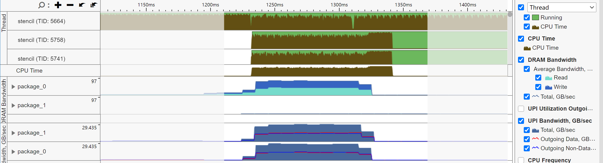
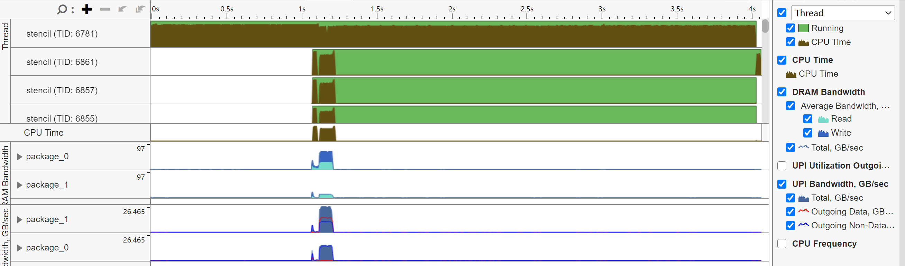
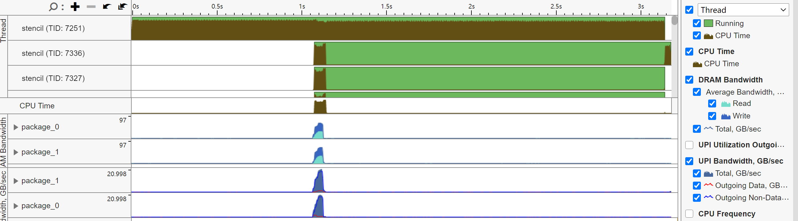

# OpenMP与NUMA

力越把之前IPCC20的stencil又翻了出来，我就顺了一份过来再研究了一波，然后发现了一些有意思的东西

## NUMA访存有问题

我在star0上弄好了VTune的硬件采样驱动，当即就去跑了一下，然后发现事情不太对



这里只有package_0的内存带宽是起来的，UPI带宽还拉满了，说明内存空间全部被分配到了NUMA0，CPU1的核心既要互相打架抢UPI带宽，又要跟CPU0打架抢内存带宽

然后我再对比了一下全核拉满和只开CPU0，这个是全核的：

```text
Trial        Time, ms
    1          12.221
    2           9.013
    3           9.019
    4           8.986
    5           9.028
    6           8.947
    7           9.004
    8           9.035
    9           8.972
   10           8.999
-----------------------------------------------------
Total :       93.2 ms
-----------------------------------------------------
```

这个是只开CPU0的：

```text
Trial        Time, ms
    1           7.284
    2           6.753
    3           6.523
    4           6.447
    5           6.430
    6           6.386
    7           6.436
    8           6.437
    9           6.412
   10           6.374
-----------------------------------------------------
Total :       65.5 ms
-----------------------------------------------------
```

懂了，这叫做拔掉CPU1以提升性能

## 多线程数据初始化

网上搜索一下"OpenMP NUMA"其实是能搜出来一些材料的，比如[这个OpenMP官方的PPT](https://www.openmp.org/wp-content/uploads/openmp-webinar-vanderPas-20210318.pdf)就写了要用多线程初始化数据，在stencil这个算例里面就是这样

```c
#pragma omp parallel for
  for(int i = 0; i < height; i++)
    for(int j = 0; j < width; j++)
	    pixel[i*width+j] = (P) row[i][j];
```

这就涉及操作系统内存分配的机制，进程申请内存空间时，操作系统只是将进程内存空间中的某一段标记为可用，等到进程真正访问时会产生缺页中断，此时操作系统再分配物理页（如果进程没有申请空间那就是非法访问了）。对于NUMA系统，操作系统默认采用First-Touch策略，在引发缺页异常的CPU所处的node分配内存

这里拉满核心初始化数据就能让两个node都分配到内存，当然我们还要确保线程正确绑核，不然线程乱跳搞NUMA的东西就没意义了

把多线程初始化搞完了，再来跑一次

```text
Trial        Time, ms
    1           9.298
    2           9.018
    3           8.998
    4           9.017
    5           9.040
    6           9.020
    7           8.972
    8           8.999
    9           8.996
   10           8.977
-----------------------------------------------------
Total :       90.3 ms
-----------------------------------------------------
```

这怎么就没区别？？？再跑一次Profile看看



现在是读取分配到了两个node上，但是写入只有一个node，成功了，但又没完全成功

## 研究进程的内存分配

这里我给源代码插了个sleep函数，让它分配完空间后停住，然后看一下内存分配情况

```bash
cat /proc/6975/numa_maps
```

这里的6975是进程id，打印出来的东西翻了一下有一行很显眼

```text
2ade4fb1a000 default anon=60441 dirty=60441 N0=30209 N1=30232 kernelpagesize_kB=4
```

这里大概有240MB，而且是均分到两个node的，应该就是读取数据，但是写入数据怎么没了，我再翻了下发现

```text
01995000 default heap anon=60095 dirty=60095 N0=60095 kernelpagesize_kB=4
```

这里这个看起来就是写入数据空间了，确实是只有node0，而且这里还有一个heap，但是为什么读取和写入会有这个差别？它们都是malloc分配的，还能不一样？

我对着源码研究了半天发现在读取数据空间分配前有几个缓冲区的空间申请

```c
png_bytep* row = (png_bytep*) malloc(sizeof(png_bytep) * height);
for (int i = 0; i < height; i++)
row[i] = (png_byte*) malloc(png_get_rowbytes(ptr, info));  
png_read_image(ptr, row);
```

在这里的前后中断一下看看堆空间，发现确实是这里申请的内存

```text
01d26000 default heap anon=16 dirty=16 N0=16 kernelpagesize_kB=4

01c4d000 default heap anon=60089 dirty=60089 N0=60089 kernelpagesize_kB=4
```

这么看来，是malloc复用了缓冲区释放的堆空间给写入数据，这里我再手动用mmap申请新的空间试试看

```text
Trial        Time, ms
    1           3.573
    2           3.263
    3           3.195
    4           3.192
    5           3.169
    6           3.179
    7           3.158
    8           3.167
    9           3.155
   10           3.206
-----------------------------------------------------
Total :       32.3 ms
-----------------------------------------------------
```



好！很有精神！

## 一点结论

1. OpenMP是一个SMP共享内存的模型，没有原生的NUMA支持，最好还是不要跨node用（虽然OpenMP 5.0加了一些内存管理方面的东西，不过我没看懂就是了）
2. 实在要跨node用，要用并行初始化的方法让内存分配到多个node上
3. malloc其实也有点玄学的
